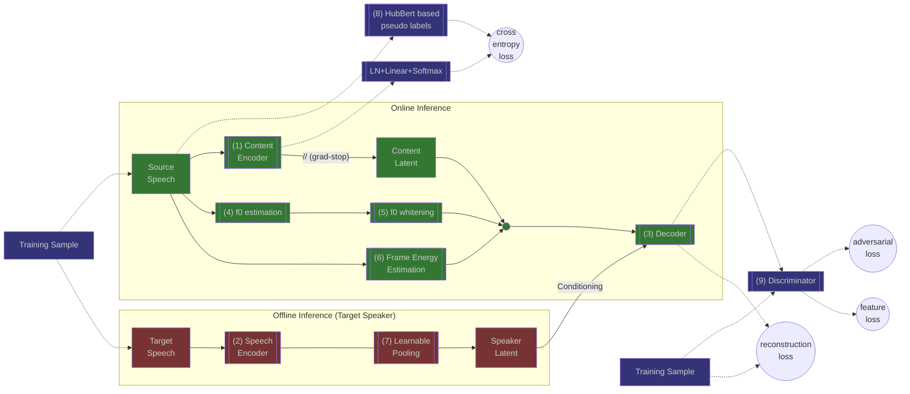
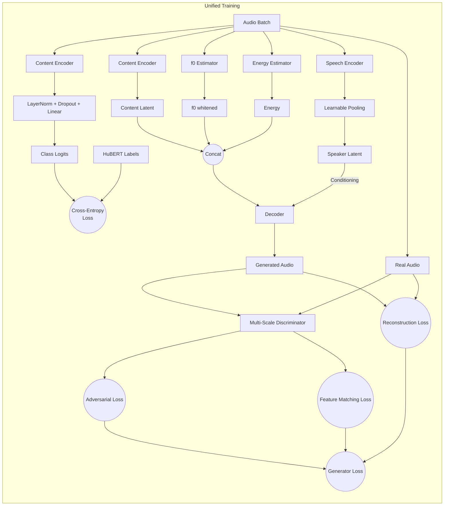

# StreamVC
An unofficial pytorch implementation of [STREAMVC: REAL-TIME LOW-LATENCY VOICE CONVERSION](https://arxiv.org/pdf/2401.03078.pdf) created for learning purposes.

This is not an official product, and while the code should work, I don't have a trained model checkpoint to share.
If you successfully trained the model, I encourage you to share it on Hugging Face, and ping me so I can link it here.

The streaming inference as it is in the paper isn't fully implemented, and I have no plans to implement it.



## Training Flow (High-Level)
Training is performed in a single unified stage. In each step, three phases are executed sequentially:

1. **Content Encoder** — classification loss (cross-entropy with HuBERT pseudo labels)
2. **Generator (Decoder + Speech Encoder)** — adversarial + feature matching + reconstruction loss
3. **Discriminator** — adversarial loss



## Example Usage
### Training
#### Requirements
To install the requirements for training run:
```bash
pip install -r requirements-training.txt
```
#### Preprocess the datasets
`preprocess_dataset.py` is the python script for dataset preprocessing.
This script downloads the specified LibriTTS split, compress it locally into `ogg` files,
and creates the HuBert labels for it.
To  view the dataset and see the available splits, go to [mythicinfinity/libritts](https://huggingface.co/datasets/mythicinfinity/libritts).
To launch the script, run:
```bash
python preprocess_dataset.py --split [SPLIT-NAME]
```
It is recommended to download all the train splits as well as the clean dev & test at least.
To see additional available option:
```bash
python preprocess_dataset.py --help
```

#### Running the training script

The training of StreamVC is done in a single unified stage where the content encoder, generator (decoder + speech encoder), and discriminator are all trained jointly. 

An example of launching the training script:
```bash
accelerate launch \
    train.py \
    --run-name myrun_228 \
    --batch_size 24 \
    --num-epochs 30 \
    --lr 1e-4 \
    --datasets.train-dataset-path "./dataset/train-clean-100" "./dataset/train-clean-360" \
    --model-checkpoint-interval 500 \
    --log-gradient-interval 500 \
    lr-scheduler:cosine-annealing-warm-restarts \
    --lr-scheduler.T-0 3000
```
### Inference
#### Requirements
To install the requirements for inference run:
```bash
pip install -r requirements-inference.txt
```
#### Running the script
 `inference.py` is the python script for inference on a single source & target combo.


To launch the script, run:
```bash
python inference.py -c <model_checkpoint> -s <source_speech> -t <target_speech> -o <output_file>
```
For eaxmaple
```bash
python inference.py \
    -c /root/autodl-tmp/cmy/StreamVC/checkpoints/myrun_228_state_epoch8/pytorch_model_1.bin \
    -s /root/autodl-tmp/cmy/StreamVC/LibriTTS/test-clean/1089/134686/1089_134686_000001_000001.wav \
    -t /root/autodl-tmp/cmy/StreamVC/LibriTTS/test-clean/672/122797/672_122797_000002_000002.wav \
    -o output.wav
```


## Acknowledgements
This project was made possible by the following open source projects:

 - For the encoder-decoder architecture (based on SoundStream) we based our code on [AudioLM's official implementation](https://github.com/lucidrains/audiolm-pytorch).
 - For the multi-scale discriminator and the discriminator losses we based our code on [MelGan's official implementation](https://github.com/descriptinc/melgan-neurips).
 -  For the HuBert discrete units computation we used the HuBert + KMeans implementation from [SoftVC's official implementation](https://github.com/bshall/soft-vc).
 - For the Yin algorithm we based our implementation on the [torch-yin package](https://github.com/brentspell/torch-yin).